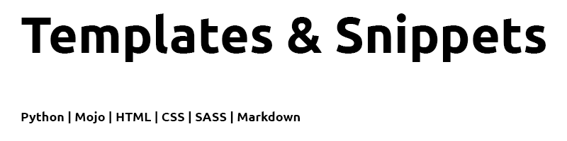

[//]: # "TITLE"

# Templates and Snippets _(Templates-and-Snippets)_

[STATUS]: # "Required"
[NOTE]: # "Title must match repository, folder and package manager names - or it may have another, relevant title with the repository, folder, and package manager title next to it in italics and in parentheses."

<!----------------------------------------------------------->

[//]: # "BANNER"
[STATUS]: # "Optional"
[NOTE]: # "Must not have its own title, must link to local image in current repository, must appear directly after the title."

<!----------------------------------------------------------->

[//]: # "BADGES"
[STATUS]: # "Optional"
[NOTE]: # "Must not have its own title, must be newline delimited."

<!----------------------------------------------------------->

[//]: # "SHORT DESCRIPTION"
[STATUS]: # "Required"
[NOTE]: # "less than 120 characters, match the description in the packager manager's description field, Must match GitHub's description"

Templates and snippets for Python, HTML, CSS & SASS, and Markdown.

<!----------------------------------------------------------->

[//]: # "LONG DESCRIPTION"
[STATUS]: # "Optional"
[NOTE]: # "Must not have its own title. If any of the folder, repository, or package manager names do not match, there must be a note here as to why."
[NOTE]: # "This should describe your module in broad terms, generally in just a few paragraphs. Ideally, someone who's slightly familiar with your module should be able to refresh their memory without hitting 'page down'. As your reader continues through the document, they should receive a progressively greater amount of knowledge."

<!----------------------------------------------------------->

[//]: # "TABLE OF CONTENTS"
[STATUS]: # "Required; optional for READMEs shorter than 100 lines."
[NOTE]: # "Must link to all Markdown sections in the file, must start with the next section, must be at least one-depth and capture all ## headings."

## Table of Contents

- [<b>Background</b>](#background)
- [<b>Install</b>](#install)
- [<b>Usage</b>](#usage)
- [<b>Snippets</b>](#snippets)
- [<b>Templates</b>](#templates)
- [<b>Security</b>](#security)
- [<b>Maintainers</b>](#maintainers)
- [<b>Thanks</b>](#thanks)
- [<b>License</b>](#license)

<!----------------------------------------------------------->

[//]: # "BACKGROUND"
[STATUS]: # "Optional"
[NOTE]: # "Cover motivation and intellectual provenance (sources of influence). Cover abstract dependencies."

## Background

Python programmers tend to not enjoy working with HTML and CSS - and who can blame them? Most of it is reused from project to project with just some basic changes. Intensive HTML and CSS work is for designers, not programmers. Inspired by [@NeuralNine](https://github.com/NeuralNine)'s and others dislike of HTML and CSS, this repository will grow to contain as many useful HTML, CSS and SASS templates as possible.

[Emmet](https://docs.emmet.io) is a great web-developer’s toolkit that takes the snippets idea to a whole new level. This project's goal is to expand on Emmet snippets to eliminate as much HTML and CSS work as possible, maximizing Python programmers' use of time on actually programming in Python.

To further facilitate fast Python programming, there is an ever-expanding list of Python templates for various frameworks and modules. As I expand my repertoire, I will be adding additional templates to the collection.

This repository is updated on regular basis.

<!----------------------------------------------------------->

[//]: # "INSTALL"
[STATUS]: # "Required by default, optional for documentation repositories."
[NOTE]: # "Requirements: Code block illustrating how to install.
Subsections: Dependencies. Required if there are unusual dependencies or dependencies that must be manually installed.
Suggestions: Link to prerequisite sites for programming language: npmjs, godocs, etc. Include any system-specific information needed for installation. An Updating section would be useful for most packages, if there are multiple versions which the user may interface with."

## Install

This project does not require any additional installations.

<!----------------------------------------------------------->

[//]: # "USAGE"
[STATUS]: # "Optional"
[NOTE]: # "Code block illustrating common usage. Cover basic choices that may affect usage."

## Usage

This is only a documentation, templates, and code snippets package.

<!----------------------------------------------------------->

[//]: # "Snippets"
[STATUS]: # "Optional"
[NOTE]: # "Extra Section"

## Snippets

Go to Settings > User Snippets, open the appropriate language's json file and paste the content of the matching snippets file bellow:

 [html.json](https://github.com/ilya0x/Templates-and-Snippets/blob/main/snippets/html.json)

 [css.json](https://github.com/ilya0x/Templates-and-Snippets/blob/main/snippets/css.json)

 [sass.json](https://github.com/ilya0x/Templates-and-Snippets/blob/main/snippets/sass.json)

 [markdown.json](https://github.com/ilya0x/Templates-and-Snippets/blob/main/snippets/markdown.json)

 [python.json](https://github.com/ilya0x/Templates-and-Snippets/blob/main/snippets/python.json)

<!----------------------------------------------------------->

[//]: # "Templates"
[STATUS]: # "Optional"
[NOTE]: # "Extra Section"

## Templates

 HTML:

- <i>generic</i>:
  - [index-simple.html](templates/html/generic/index-simple.html)
  - [index-long.html](templates/html/generic/index-long.html)
- Flask framework:
  - [base.html](templates/html/flask/base.html)
  - [index.html](templates/html/flask/index.html)
- Django framework:
  - [base.html](templates/html/django/base.html)
  - [header.html](templates/html/django/header.html)
  - [footer.html](templates/html/django/footer.html)
     

 CSS:

- [styles.css](templates/styles/stylesheets/styles.css)
   

 SASS:

- [template.sass](templates/style/sass/template.sass)
   

 Markdown:

- [README.md](templates/markdown/README.md) - Setup according to [standard-readme](https://github.com/RichardLitt/standard-readme) standard style, including NOTES.
   

 Python:

- <i>generic</i>:
  - [main.py](templates/python/generic/main.py)
  - [app.py](templates/python/generic/app.py)
- Flask:
  - [run.py](templates/python/flask/run.py)
  - [config.py](templates/python/flask/config.py)
- Django:
  - [manage.py](templates/python/django/manage.py) - This is a command-line utility to interact with the Django project.
  - [settings.py](templates/python/django/settings.py) - Project settings.
  - [urls.py](templates/python/django/urls.py) - Defines the app’s URL patterns.
  - [admin.py](templates/python/django/admin.py) - Configures the Django admin interface for managing app models.
  - [apps.py](templates/python/django/apps.py) - App configuration and metadata.
  - [models.py](templates/python/django/models.py) - Defines the app’s data models.
  - [views.py](templates/python/django/views.py) - Contains the views or controller functions for handling HTTP requests.
  - [forms.py](templates/python/django/forms.py) - Includes form classes if the app requires custom forms.
- PyGame:
  - [game-name.py](templates/python/pygame/game-name.py)
- PySide6:
  - [appwindow.py](templates/python/pyside6/appwindow.py)
  - [main.py](templates/python/pyside6/main.py)
- PyTorch:
  - [main.py](templates/python/pytorch/main.py)
  - [model.py](templates/python/pytorch/model.py)
  - TorchAudio:
    - [app.py](templates/python/pytorch/torchaudio/app.py)
       

<!----------------------------------------------------------->

[//]: # "SECURITY"
[STATUS]: # "Optional"
[NOTE]: # "May go here if it is important to highlight security concerns."

## Security

- Templates contain placeholder IP addresses and ports. You will need to replace them for your specifications.
- Same goes for placeholder usernames and passwords.

<!----------------------------------------------------------->

[//]: # "API"
[STATUS]: # "Optional"
[NOTE]: # "Describe exported functions and objects. Describe signatures, return types, callbacks, and events. Cover types covered where not obvious. Describe caveats. If using an external API generator (like go-doc, js-doc, or so on), point to an external API.md file."

<!----------------------------------------------------------->

[//]: # "MAINTAINER"
[STATUS]: # "Optional"
[NOTE]: # "List maintainer(s) for a repository, along with one way of contacting them (e.g. GitHub link or email)."

## Maintainer

[@ilya0x](https://github.com/ilya0x)

<!----------------------------------------------------------->

[//]: # "THANKS"
[STATUS]: # "Optional"
[NOTE]: # "Must be called Thanks, Credits or Acknowledgements. State anyone or anything that significantly helped with the development of your project. State public contact hyper-links if applicable."

## Thanks

[@RichardLitt](https://github.com/RichardLitt) for the [standard-readme](https://github.com/RichardLitt/standard-readme) standard style creation.

<!----------------------------------------------------------->

[//]: # "CONTRIBUTING"
[STATUS]: # "Required"
[NOTE]: # "State where users can ask questions. State whether PRs are accepted. List any requirements for contributing; for instance, having a sign-off on commits. Link to a CONTRIBUTING file -- if there is one. Link to a CONTRIBUTING file -- if there is one."

<!----------------------------------------------------------->

[//]: # "LICENSE"
[STATUS]: # "Required"
[NOTE]: # "State license full name or identifier, as listed on the SPDX license list. For unlicensed repositories, add UNLICENSED. For more details, add SEE LICENSE IN <filename> and link to the license file. (These requirements were adapted from npm). State license owner. Must be last section."

## License

MIT License

SEE LICENSE IN <a href="https://github.com/ilya0x/Templates-and-Snippets/blob/main/LICENSE.txt">LICENSE.txt</a>

<!----------------------------------------------------------->
